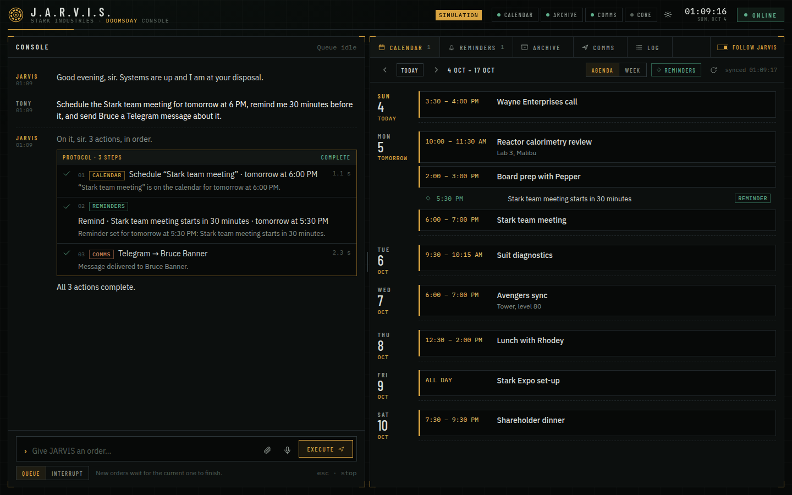

# J.A.R.V.I.S.

A command centre for Tony Stark's day: one console that talks to Google Calendar, Google Drive and Telegram, keeps personal reminders, and runs several orders in sequence while showing the result live next to the conversation.



Left: the console. Type an order, watch it execute step by step. Right: the live preview of whatever JARVIS just touched (calendar, reminders, the Drive archive, the comms log, the action log). Nothing is a mock-up of an integration: orders call the real Google and Telegram APIs.

## Run it

Needs Node 20.12 or newer.

```bash
npm install
npm run demo        # simulated accounts, nothing saved, no setup
```

Open http://localhost:3000. Demo mode is for looking around: Calendar, Drive and Telegram are replaced by in-memory stand-ins (a **SIMULATION** badge stays in the header). For real accounts:

```bash
cp .env.example .env    # fill it in, see below
npm start
```

Each link works independently. Leave Telegram unset and everything else still runs; JARVIS says which link is down and why, both at startup and the moment you ask it to use that link.

### Google (Calendar + Drive)

1. In [Google Cloud Console](https://console.cloud.google.com/) create a project and enable the **Google Calendar API** and **Google Drive API**.
2. *APIs & Services → OAuth consent screen*: choose External, add yourself as a **test user**.
3. *Credentials → Create credentials → OAuth client ID → Web application*. Add the authorised redirect URI `http://localhost:3000/auth/google/callback` (or `PUBLIC_URL` + `/auth/google/callback`).
4. Put the client id and secret in `.env`, start the server, then use **Systems → Connect Google** (the gear in the header). After sign-in the Archive pane opens on your Drive.

Scopes requested: `calendar` and `drive`. Full Drive access is needed because the preview browses any folder and search covers files that JARVIS did not create (`drive.file` only sees app-created files). While the consent screen is in "testing" Google shows an "unverified app" warning; that's expected for a personal install.

Tokens are stored in `data/jarvis.json` (file mode 600, git-ignored). If Google rejects them later (revoked, expired testing token after 7 days) JARVIS marks the account **expired**, says so in the failing step, and offers Reconnect.

### Telegram

1. Message [@BotFather](https://t.me/BotFather), `/newbot`, copy the token into `TELEGRAM_BOT_TOKEN`.
2. Each person you want to message must open your bot and press **Start**. Bots cannot message someone first; this is a Telegram rule, not a JARVIS limit.
3. In the **Comms → Contacts** tab press **Scan**: chats that reached the bot appear with their chat ids, one click adds them. Or seed `TELEGRAM_CONTACTS="Bruce Banner=123456789,Stark Team=-1001234567890"`.

### Language model (optional)

Set `ANTHROPIC_API_KEY` and JARVIS uses the model to turn free-form orders into plans. Without it, a built-in parser handles the same orders (see below). If the API is unreachable mid-session JARVIS falls back to the built-in parser for that order and says so; the **Core** chip in the header turns amber.

## Using it

Examples that work as typed:

| Order | What happens |
| --- | --- |
| `Schedule a meeting with Bruce tomorrow at 5 PM` | Event created on your primary calendar; the Calendar pane jumps to it. Overlaps are flagged. |
| `Schedule lunch with pepper@stark.example Friday at noon for 90 minutes` | Guests are invited by email, so JARVIS asks first. |
| `Remind me to check the reactor at 8 PM` | Personal reminder (not a calendar event), listed in Reminders and shown as a ◇ in the Calendar. |
| `What do I have scheduled for tomorrow?` | Events plus reminders for that day. |
| `Move the Avengers sync to Friday at 4pm` / `Cancel the suit diagnostics` | Reschedules / cancels (cancelling asks first). |
| `Find the reactor design report` | Searches Drive by name, then file contents, then partial matches. Name, type, folder, modified time, open link. |
| `Upload this to the Research folder` | With a file attached (paperclip or drag onto the console), or opens the upload panel if there isn't one. |
| `Send Bruce a message saying the experiment is postponed` | Resolves Bruce from contacts, shows the exact text, waits for your go-ahead, sends, logs delivery. |
| `Schedule the Stark team meeting for tomorrow at 6 PM, remind me 30 minutes before it, and send Bruce a Telegram message about it` | Three steps in order. The reminder is computed from the event; the message is composed from it. A failed step skips only what depends on it. |

**When something is missing, it asks.** "Schedule a meeting with Bruce" → *When should I schedule “Meeting with Bruce”?* → "tomorrow" → *What time tomorrow?* → "5" → *Is that 5 AM or 5 PM?*. Unknown recipients, missing message text, unknown folders ("create it") and past times are handled the same way. Nothing runs until the whole order is valid.

**Queue or interrupt.** The switch under the input decides what a new order does while another is running. *Queue*: it waits its turn (the queue strip shows what is executing and what is waiting; each can be cancelled). *Interrupt*: the running order stops after its current step and the new one runs first. `Esc` stops the running order.

**Consequential actions wait for you.** Sending a message, inviting guests and cancelling an event show the exact content inside the step and wait for *Authorise* / *Hold*. Turn this off under Systems if you'd rather not be asked. Actions you click yourself (resend, delete in the preview) are not asked twice.

**Failures are specific.** A step that fails shows the reason in plain words and, where it helps, an action: *Reconnect Google*, *Open systems*, *Retry failed steps* (re-runs only what failed). Examples: Google authorisation expired, the Calendar API not enabled for the project, Telegram "chat not found / hasn't pressed Start", token revoked, folder doesn't exist, upload interrupted.

**Everything is logged.** The Log tab lists every action with who triggered it (typed to JARVIS, or clicked in the console). Comms shows each message with recipient, text, time and delivery status, including held-back and failed ones.

Reminders live on the server; they fire (banner, toast, optional desktop notification) only while JARVIS is running.

## How it fits together

```
browser ── POST /api/commands ──▶ queue ──▶ planner ──▶ validate ──▶ executor ──▶ tools ──▶ Calendar / Drive / Telegram / reminders
   ▲                              (one at a time)   │                    │
   └──────────── SSE: job, queue, focus, refresh ◀──┴────────────────────┘
```

- `server/brain/planner.js`: turns text into steps, either via the language model (`llm.js`, forced tool call) or the built-in parser (`rules.js`, chrono-node for dates plus clause splitting). Both produce the same shape, and both go through the same per-tool validation before anything runs, so the model can't skip a safeguard.
- `server/brain/tools.js`: the capabilities (calendar create/list/update/delete, reminders, Drive search/browse/folder/upload, Telegram send). Each declares its arguments, label, whether it needs confirmation, and how to run.
- `server/brain/queue.js`: the job queue and executor: sequential execution, interrupt, per-step state, confirmations, dependency skipping, retry, activity log.
- `server/integrations/`: `google.js` (OAuth, Calendar, Drive, error translation), `telegram.js`, and `demo.js` (the simulation).
- `public/`: dependency-free ES modules, no build step. Fonts are bundled so it works offline.

## Safety notes

- The server binds to `127.0.0.1` by default and holds live Google and Telegram credentials. There is no login. Don't expose it to a network you don't trust without putting authentication in front.
- State-changing requests from a foreign `Origin` are refused, and requests addressed to any host name other than `localhost`, `127.0.0.1` or your `PUBLIC_URL` are rejected (DNS-rebinding protection). If you reach JARVIS by another name, set `PUBLIC_URL` to it.
- File names and Drive content are rendered as text, never as HTML.
- Uploaded files are staged in the OS temp directory and removed after filing (or after an hour).

## Tests

```bash
npm test
```

58 tests, no accounts needed:

- the order parser (dates, relative references, clarification and slot filling, message extraction);
- the whole app over HTTP in simulation mode (queueing, interrupt, confirmation, retry, uploads, search, reminders firing);
- the real Telegram adapter against a mock Bot API (delivery, "chat not found", blocked, bad token, unreachable);
- the real Google Calendar and Drive code against an in-process stand-in for googleapis.com (event bodies, guest invites, multipart upload bytes, folder creation and paths, search queries, 401 handling);
- the language-model planner against a mock Messages API, including outage fallback.

Not covered: live calls to Google, Telegram and the Anthropic API from this repository's tests. The adapters are exercised against faithful stand-ins; the first run with real credentials is the real check.

## Known limits

- Single user, single browser session in mind. Several open tabs all see the same queue.
- A Telegram bot can only write to people who started it. Names are matched against your contact list, not looked up.
- All-day events that span several days appear on their first day in the Agenda view.
- Voice input uses the browser's speech recognition where available (Chrome, Edge, Safari).

Bundled fonts (Barlow Condensed, IBM Plex Sans/Mono) are SIL Open Font License.
